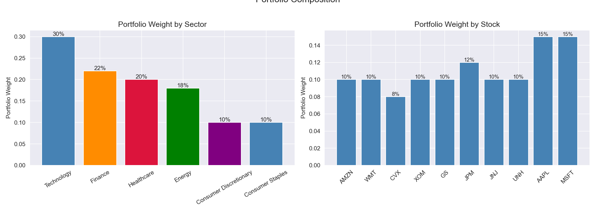
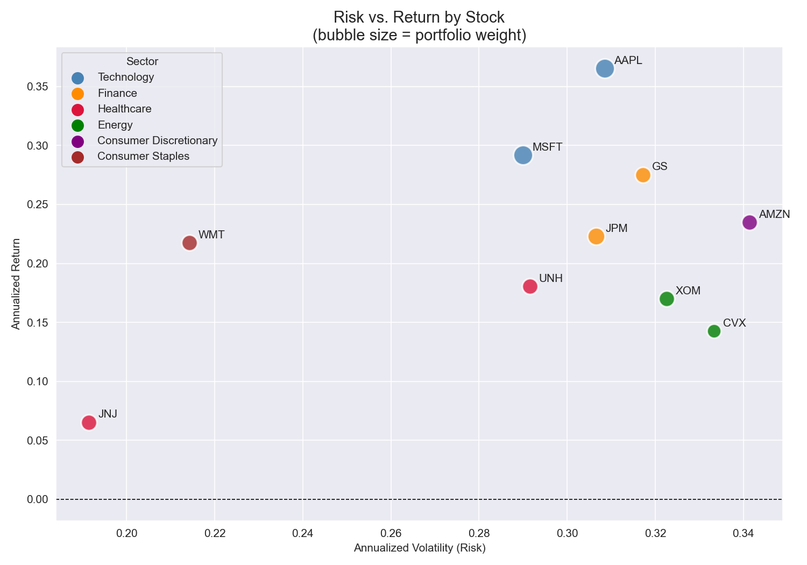
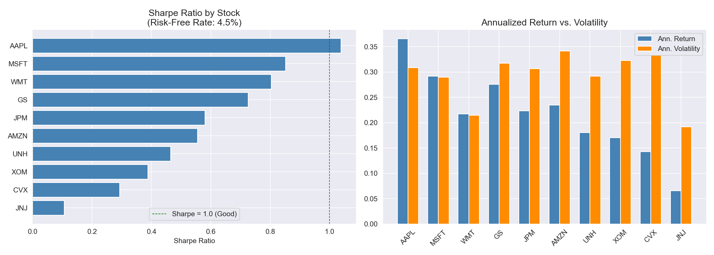
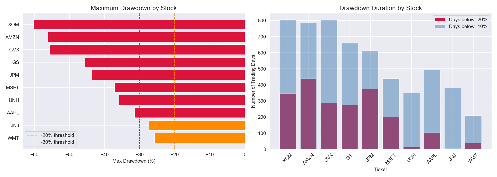
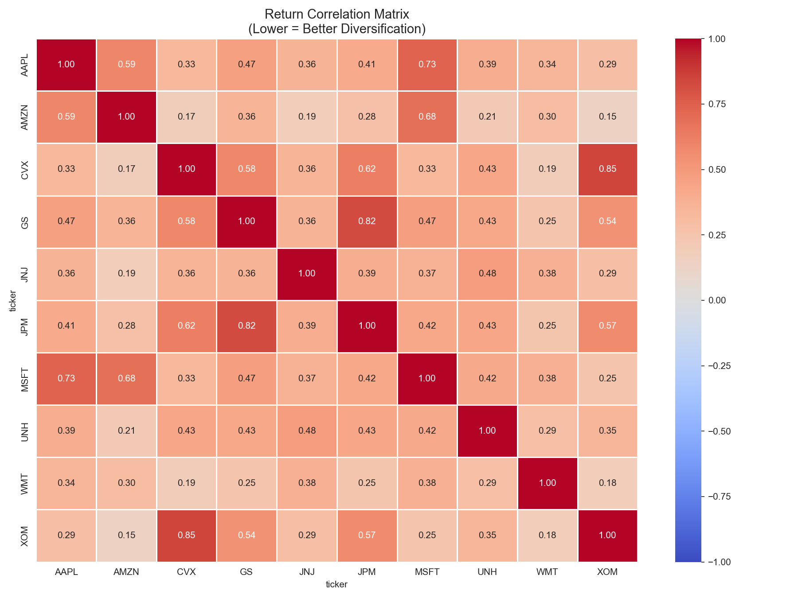
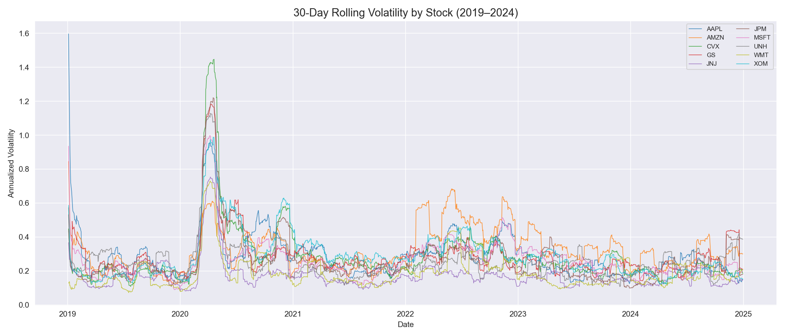
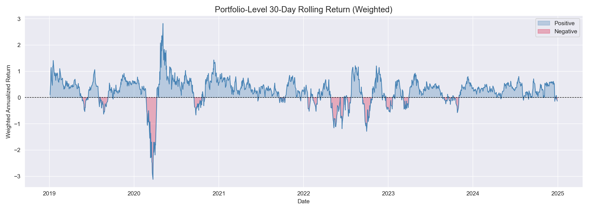

# Portfolio Risk & Return Analysis

A SQL and Python analysis of a diversified 10-stock portfolio across 5 sectors, evaluating risk-adjusted performance using Sharpe ratio, maximum drawdown, rolling volatility, and correlation analysis over a 5-year period (2019–2024).

---

## Problem Statement
Constructing and managing an investment portfolio requires balancing two competing objectives: maximizing returns and minimizing risk. This project analyzes a diversified 10-stock portfolio to answer: **Which holdings are earning their risk premium, and where does the portfolio carry hidden concentration risk?**

---

## Portfolio Holdings
| Ticker | Company            | Sector                  | Weight |
|--------|--------------------|-------------------------|--------|
| AAPL   | Apple Inc.         | Technology              | 15%    |
| MSFT   | Microsoft Corp.    | Technology              | 15%    |
| JPM    | JPMorgan Chase     | Finance                 | 12%    |
| GS     | Goldman Sachs      | Finance                 | 10%    |
| JNJ    | Johnson & Johnson  | Healthcare              | 10%    |
| UNH    | UnitedHealth Group | Healthcare              | 10%    |
| XOM    | Exxon Mobil        | Energy                  | 10%    |
| CVX    | Chevron Corp.      | Energy                  | 8%     |
| AMZN   | Amazon.com Inc.    | Consumer Discretionary  | 10%    |
| WMT    | Walmart Inc.       | Consumer Staples        | 10%    |

---

## Data Source
- **Provider:** Yahoo Finance via the `yfinance` Python library
- **Period:** January 2019 – December 2024
- **Database:** PostgreSQL (local)
- No CSV download required — data pulls automatically via API

---

## Tools & Libraries
- PostgreSQL, pgAdmin
- Python 3.x
- Pandas, NumPy
- Matplotlib, Seaborn
- yfinance
- SQLAlchemy, psycopg2

---

## Project Workflow
1. Data retrieval — pulled 5 years of daily price data for 10 stocks via yfinance API and loaded into PostgreSQL
2. SQL analysis — annual return/volatility, Sharpe ratio, maximum drawdown, and rolling performance using CTEs and Window Functions
3. Python visualization — risk/return scatter, Sharpe rankings, drawdown comparison, correlation heatmap, rolling volatility
4. Portfolio-level analysis — weighted return, diversification quality, and concentration risk identification

---

## SQL Techniques Demonstrated
- Common Table Expressions (CTEs)
- Window Functions (MAX OVER, AVG OVER, STDDEV OVER, ROWS BETWEEN UNBOUNDED PRECEDING AND CURRENT ROW)
- PARTITION BY for per-stock rolling calculations
- RANK() OVER for multi-dimensional performance ranking
- NULLIF for safe division
- Multi-table JOINs (stock_prices + portfolio)
- Mathematical casting (::NUMERIC) for precision aggregations

---

## Key Findings
- **AAPL** was the top risk-adjusted performer with the only Sharpe ratio above 1.0 (1.04), delivering 36.53% annualized return at 30.85% volatility — more than one unit of return per unit of risk
- **WMT** ranked 3rd on Sharpe ratio (0.80) despite modest returns, demonstrating that low volatility (21.43%) is as valuable as high return in portfolio construction
- **JNJ** ranked last on Sharpe ratio (0.11) — its 6.54% annualized return barely exceeded the 4.5% risk-free rate, making it a candidate for replacement in a live portfolio review
- **XOM** suffered the worst drawdown at -60.35%, spending 805 days below -10% — largely driven by the 2020 oil price collapse during COVID-19 demand destruction
- **CVX and XOM** showed 0.85 correlation, effectively making the Energy allocation a concentrated single bet — a key portfolio construction risk identified through this analysis
- **GS and JPM** showed 0.82 correlation, confirming similar concentration risk in the Finance sector allocation
- Best diversification pairs were AMZN/XOM (0.15) and AMZN/CVX (0.17) — Consumer/Technology and Energy stocks moved largely independently, providing genuine portfolio risk reduction

---

## Visualizations

### Portfolio Composition

### Risk vs. Return Scatter

### Sharpe Ratio Rankings

### Maximum Drawdown

### Correlation Heatmap

### Rolling Volatility

### Portfolio Rolling Return

---

## SQL Query Files
All queries are saved in the `sql/` folder:
- `01_create_tables.sql` — schema for stock_prices and portfolio tables
- `02_portfolio_summary.sql` — annual return and volatility per stock
- `03_risk_metrics.sql` — Sharpe ratio with risk-free rate benchmark
- `04_drawdown_analysis.sql` — maximum drawdown using rolling window
- `05_window_functions.sql` — 30-day and 90-day rolling performance

---

## Limitations & Next Steps
- Fixed portfolio weights — a real portfolio would rebalance periodically based on performance and risk targets
- Does not account for transaction costs, taxes, or slippage
- Sharpe ratio assumes normally distributed returns — a known limitation given fat-tailed financial return distributions
- Future work: mean-variance optimization, Monte Carlo simulation, Value at Risk (VaR), dividend-adjusted total return calculation

---

## How to Run This Project
1. Clone the repository
2. Install PostgreSQL and pgAdmin from [postgresql.org](https://postgresql.org)
3. Create a database called `portfolio_analysis` in pgAdmin
4. Install Python dependencies: `pip install pandas numpy matplotlib seaborn yfinance sqlalchemy psycopg2-binary`
5. Open `portfolio_analysis.ipynb` in Jupyter or VS Code
6. Update the database connection string with your PostgreSQL password
7. Run all cells — data pulls automatically from Yahoo Finance and loads into PostgreSQL

---

## Repository Structure

---

## Author
**Mihrimah Qozat**
[LinkedIn](https://linkedin.com/in/mihrimah-qozat) |
[GitHub](https://github.com/mihrimahqozat)
